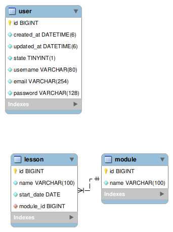

# Verzel Api

Este foi o test ou desafio que me foi proposto pela empresa Verzel a fim de testar as minhas competências como desenvolvedor nas linguagens `Python Django` e `ReactJs`.

A aplicação desenvolvida tem a finalidade de registrar módulos de cursos e as aulas que fazem parte do mesmo.

Aproveito informar que para o código, as base de dados trabalhei na lingua inglêsa com exceção das mensagens que retorna.

Recursos disponíveis para acesso via API ou endpoints(URI):
* **modules** - /api/v1/modules/
* **lessons** - /api/v1/recursos/lessons
* **users** - /api/v1/recursos/users

| Método       | Descrição                    |
| ------------ | ---------------------------- |
| `GET  POST`  | `/api/v1/modules/`           |
| `PUT DELETE` | `/api/v1/recursos/lessons/1` |

um exemplo do funcionamento das rotas.

## Modelagem da base de dados



Para rodar a aplicação siga os seguintes passos:

primeiro: crie uma base de dados com o nome `verzel_course_api`

actualize as configurações da base de dados, colocando o `user`, `password`, `host`

```python
DATABASES = {
    # 'default': {
    #     'ENGINE': 'django.db.backends.sqlite3',
    #     'NAME': BASE_DIR / 'db.sqlite3',
    # }
    'default': {
        'ENGINE': 'django.db.backends.mysql',
        'NAME': 'verzel_course_api',
        'USER': 'root',
        'PASSWORD': '',
        'HOST': '',
        'PORT': '3306'
    }
}
```
Comandos

```shell
pip install -r requirements.txt,
python manage.py makemigrations,
python manage.py migrate
python manage.py runserver
```

ou podes não executar o migrate e carregar o arquivo já com dados na tua base de dados


## Métodos
Requisições para a API devem seguir os padrões:
| Método   | Descrição                                             |
| -------- | ----------------------------------------------------- |
| `GET`    | Retorna informações de um ou mais registros.          |
| `POST`   | Utilizado para criar um novo registro.                |
| `PUT`    | Atualiza dados de um registro ou altera sua situação. |
| `DELETE` | Remove um registro do sistema.                        |


## Respostas

| Código | Descrição                                                                            |
| ------ | ------------------------------------------------------------------------------------ |
| `200`  | Requisição executada com sucesso (success).                                          |
| `400`  | Erros de validação ou os campos informados não existem no sistema.                   |
| `401`  | Dados de acesso inválidos.                                                           |
| `404`  | Registro pesquisado não encontrado (Not found).                                      |
| `405`  | Método não implementado.                                                             |
| `410`  | Registro pesquisado foi apagado do sistema e não esta mais disponível.               |
| `422`  | Dados informados estão fora do escopo definido para o campo.                         |
| `429`  | Número máximo de requisições atingido. (*aguarde alguns segundos e tente novamente*) |

## Exemplo de criação de aula

+ Request (application/json)

    + Body

            {
                "name": "Aprendendo Media Queries",
                "start_date": "2021-12-21",
                "module": 1
            }

+ Response 200 (application/json)

    + Body

            {
                "id": 5,
                "name": "Aprendendo Media Queries",
                "start_date": "2021-12-21",
                "module": 1
            }

Caso a requisição não conter nenhuma resposta o retorno será:

    {
        "detail": "Não encontrado."
    }

### Listar module e aula (List) [GET]

+ Request (application/json)

  + Headers

        Authorization: Bearer [access_token]

+ Response 200 (application/json)

        {
            "id": 1,
            "name": "Desenvolvimento FrontEnd Master",
            "lessons": [
                "http://127.0.0.1:8000/api/v1/lessons/5/",
                "http://127.0.0.1:8000/api/v1/lessons/1/",
                "http://127.0.0.1:8000/api/v1/lessons/2/",
                "http://127.0.0.1:8000/api/v1/lessons/3/",
                "http://127.0.0.1:8000/api/v1/lessons/4/"
            ]
        }


## Funcionalidades

Os recursos funcionais da aplicação são:

- [x] Criação, remoção e actualização de usuário
- [x] Criação, remoção, actualização e deleção de módulo
- [x] Criação, remoção, actualização e deleção de aula
- [x] Authenticação de usuário
- [x] Listagem das aulas em ordem alfabética
- [x] Validação dos campos antes da inserção